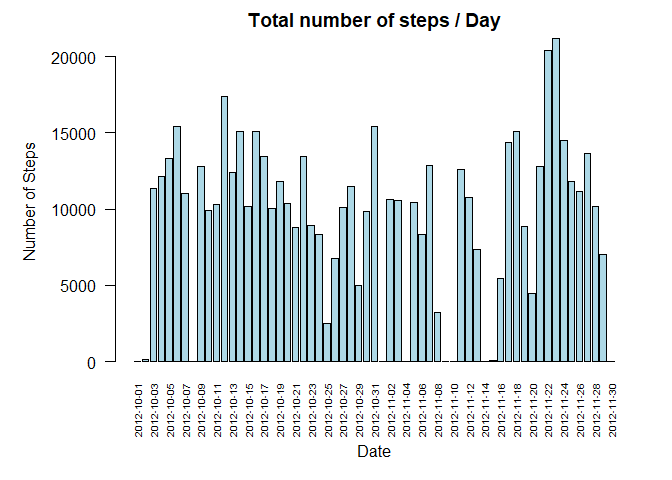
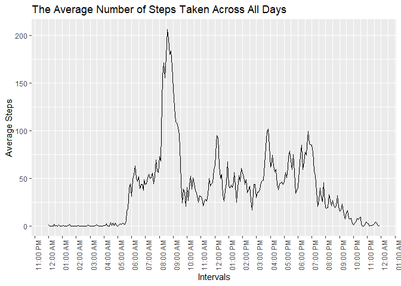
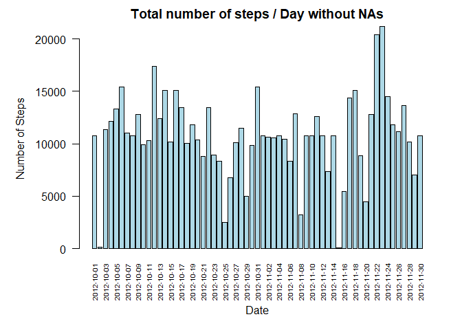

## Loading and preprocessing the data

First read the csv and load it to the activity variable using read.csv(). 


```r
activity <- read.csv("activity.csv")
str(activity)
```

```
## 'data.frame':	17568 obs. of  3 variables:
##  $ steps   : int  NA NA NA NA NA NA NA NA NA NA ...
##  $ date    : chr  "2012-10-01" "2012-10-01" "2012-10-01" "2012-10-01" ...
##  $ interval: int  0 5 10 15 20 25 30 35 40 45 ...
```

Then by looking at the data types of the activity variable's columns we find that the date column is character, so we transform it to date format and the interval column is in integer so we transform it to time format.


```r
## Transform Date
activity$date <- as.Date(activity$date)

##Transform Time
temp <- activity$interval
temp2 <- mapply(function(x, y) paste0(rep(x, y), collapse = ""), 0, 4 - nchar(temp))
temp <- paste0(temp2, temp)
activity$interval <- as.POSIXct(temp, format="%H%M")

str(activity)
```

```
## 'data.frame':	17568 obs. of  3 variables:
##  $ steps   : int  NA NA NA NA NA NA NA NA NA NA ...
##  $ date    : Date, format: "2012-10-01" "2012-10-01" ...
##  $ interval: POSIXct, format: "2020-09-22 00:00:00" "2020-09-22 00:05:00" ...
```

## What is mean total number of steps taken per day?

1. Make a histogram of the total number of steps taken each day


```r
par(mar = c(6,6,2,2))
barplot(tapply(activity$steps, activity$date, sum, na.rm = TRUE), las = 2, col = "light blue", main = "Total number of steps / Day", cex.names = 0.6)
title(xlab = "Date", line = 4)
title(ylab = "Number of Steps", line = 4)
```

<!-- -->

2. Calculate and report the mean and median total number of steps taken per day.


```r
## Mean
mean1 <- as.data.frame(tapply(activity$steps, activity$date, mean, na.rm = TRUE))
names(mean1)[1] <- "Mean"
mean1
```

```
##                  Mean
## 2012-10-01        NaN
## 2012-10-02  0.4375000
## 2012-10-03 39.4166667
## 2012-10-04 42.0694444
## 2012-10-05 46.1597222
## 2012-10-06 53.5416667
## 2012-10-07 38.2465278
## 2012-10-08        NaN
## 2012-10-09 44.4826389
## 2012-10-10 34.3750000
## 2012-10-11 35.7777778
## 2012-10-12 60.3541667
## 2012-10-13 43.1458333
## 2012-10-14 52.4236111
## 2012-10-15 35.2048611
## 2012-10-16 52.3750000
## 2012-10-17 46.7083333
## 2012-10-18 34.9166667
## 2012-10-19 41.0729167
## 2012-10-20 36.0937500
## 2012-10-21 30.6284722
## 2012-10-22 46.7361111
## 2012-10-23 30.9652778
## 2012-10-24 29.0104167
## 2012-10-25  8.6527778
## 2012-10-26 23.5347222
## 2012-10-27 35.1354167
## 2012-10-28 39.7847222
## 2012-10-29 17.4236111
## 2012-10-30 34.0937500
## 2012-10-31 53.5208333
## 2012-11-01        NaN
## 2012-11-02 36.8055556
## 2012-11-03 36.7048611
## 2012-11-04        NaN
## 2012-11-05 36.2465278
## 2012-11-06 28.9375000
## 2012-11-07 44.7326389
## 2012-11-08 11.1770833
## 2012-11-09        NaN
## 2012-11-10        NaN
## 2012-11-11 43.7777778
## 2012-11-12 37.3784722
## 2012-11-13 25.4722222
## 2012-11-14        NaN
## 2012-11-15  0.1423611
## 2012-11-16 18.8923611
## 2012-11-17 49.7881944
## 2012-11-18 52.4652778
## 2012-11-19 30.6979167
## 2012-11-20 15.5277778
## 2012-11-21 44.3993056
## 2012-11-22 70.9270833
## 2012-11-23 73.5902778
## 2012-11-24 50.2708333
## 2012-11-25 41.0902778
## 2012-11-26 38.7569444
## 2012-11-27 47.3819444
## 2012-11-28 35.3576389
## 2012-11-29 24.4687500
## 2012-11-30        NaN
```

```r
## Median
median <- as.data.frame(tapply(activity$steps, activity$date, median, na.rm = TRUE))
names(median)[1] <- "Median"
median
```

```
##            Median
## 2012-10-01     NA
## 2012-10-02      0
## 2012-10-03      0
## 2012-10-04      0
## 2012-10-05      0
## 2012-10-06      0
## 2012-10-07      0
## 2012-10-08     NA
## 2012-10-09      0
## 2012-10-10      0
## 2012-10-11      0
## 2012-10-12      0
## 2012-10-13      0
## 2012-10-14      0
## 2012-10-15      0
## 2012-10-16      0
## 2012-10-17      0
## 2012-10-18      0
## 2012-10-19      0
## 2012-10-20      0
## 2012-10-21      0
## 2012-10-22      0
## 2012-10-23      0
## 2012-10-24      0
## 2012-10-25      0
## 2012-10-26      0
## 2012-10-27      0
## 2012-10-28      0
## 2012-10-29      0
## 2012-10-30      0
## 2012-10-31      0
## 2012-11-01     NA
## 2012-11-02      0
## 2012-11-03      0
## 2012-11-04     NA
## 2012-11-05      0
## 2012-11-06      0
## 2012-11-07      0
## 2012-11-08      0
## 2012-11-09     NA
## 2012-11-10     NA
## 2012-11-11      0
## 2012-11-12      0
## 2012-11-13      0
## 2012-11-14     NA
## 2012-11-15      0
## 2012-11-16      0
## 2012-11-17      0
## 2012-11-18      0
## 2012-11-19      0
## 2012-11-20      0
## 2012-11-21      0
## 2012-11-22      0
## 2012-11-23      0
## 2012-11-24      0
## 2012-11-25      0
## 2012-11-26      0
## 2012-11-27      0
## 2012-11-28      0
## 2012-11-29      0
## 2012-11-30     NA
```

## What is the average daily activity pattern?

1. Make a time series plot (i.e. type = "l") of the 5-minute interval (x-axis) and the average number of steps taken, averaged across all days (y-axis)


```r
library(ggplot2)
ggplot(activity, aes(interval, steps)) + stat_summary(fun = mean, geom = "line", na.rm = TRUE) + labs(y = "Average Steps", x = "Intervals", title = "The Average Number of Steps Taken Across All Days") + scale_x_datetime(date_breaks = "1 hour", date_labels = "%I:%M %p") + theme(axis.text.x = element_text(angle = 90))
```

<!-- -->

2. Which 5-minute interval, on average across all the days in the dataset, contains the maximum number of steps?


```r
intervals <- as.data.frame(tapply(activity$steps, activity$interval, mean, na.rm = TRUE))
rname <- rownames(intervals)[apply(intervals,2,which.max)]
substr(rname, nchar(rname) - 8 + 1, nchar(rname)) 
```

```
## [1] "08:35:00"
```

## Imputing missing values

1. Calculate and report the total number of missing values in the dataset (i.e. the total number of rows with NAs)


```r
sum(!complete.cases(activity))
```

```
## [1] 2304
```

2. Devise a strategy for filling in all of the missing values in the dataset. Will use the mean for that 5-minute interval as it gets the approximate value at that time. We use the intervals data frame created before containing the interval and its mean (average).

Create a new dataset that is equal to the original dataset but with the missing data filled in.


```r
activity2 <- activity
for(i in 1:nrow(activity2))
{
        if(is.na(activity2[i,"steps"]))
        {
                activity2[i,"steps"] <- intervals[as.character(activity2[i,"interval"]),]
        }
}
```

4. Make a histogram of the total number of steps taken each day and Calculate and report the mean and median total number of steps taken per day. Do these values differ from the estimates from the first part of the assignment? What is the impact of imputing missing data on the estimates of the total daily number of steps?


```r
par(mar = c(6,6,2,2))
barplot(tapply(activity2$steps, activity2$date, sum, na.rm = TRUE), las = 2, col = "light blue", main = "Total number of steps / Day without NAs", cex.names = 0.6)
title(xlab = "Date", line = 4)
title(ylab = "Number of Steps", line = 4)
```

<!-- -->

the mean and medians without NAs

```r
## Mean
mean2 <- as.data.frame(tapply(activity2$steps, activity2$date, mean, na.rm = TRUE))
names(mean2)[1] <- "Mean"
mean2
```

```
##                  Mean
## 2012-10-01 37.5068700
## 2012-10-02  0.4375000
## 2012-10-03 39.4166667
## 2012-10-04 42.0694444
## 2012-10-05 46.1597222
## 2012-10-06 53.5416667
## 2012-10-07 38.2465278
## 2012-10-08 37.5068700
## 2012-10-09 44.4826389
## 2012-10-10 34.3750000
## 2012-10-11 35.7777778
## 2012-10-12 60.3541667
## 2012-10-13 43.1458333
## 2012-10-14 52.4236111
## 2012-10-15 35.2048611
## 2012-10-16 52.3750000
## 2012-10-17 46.7083333
## 2012-10-18 34.9166667
## 2012-10-19 41.0729167
## 2012-10-20 36.0937500
## 2012-10-21 30.6284722
## 2012-10-22 46.7361111
## 2012-10-23 30.9652778
## 2012-10-24 29.0104167
## 2012-10-25  8.6527778
## 2012-10-26 23.5347222
## 2012-10-27 35.1354167
## 2012-10-28 39.7847222
## 2012-10-29 17.4236111
## 2012-10-30 34.0937500
## 2012-10-31 53.5208333
## 2012-11-01 37.5068700
## 2012-11-02 36.8055556
## 2012-11-03 36.7048611
## 2012-11-04 37.5068700
## 2012-11-05 36.2465278
## 2012-11-06 28.9375000
## 2012-11-07 44.7326389
## 2012-11-08 11.1770833
## 2012-11-09 37.5068700
## 2012-11-10 37.5068700
## 2012-11-11 43.7777778
## 2012-11-12 37.3784722
## 2012-11-13 25.4722222
## 2012-11-14 37.5068700
## 2012-11-15  0.1423611
## 2012-11-16 18.8923611
## 2012-11-17 49.7881944
## 2012-11-18 52.4652778
## 2012-11-19 30.6979167
## 2012-11-20 15.5277778
## 2012-11-21 44.3993056
## 2012-11-22 70.9270833
## 2012-11-23 73.5902778
## 2012-11-24 50.2708333
## 2012-11-25 41.0902778
## 2012-11-26 38.7569444
## 2012-11-27 47.3819444
## 2012-11-28 35.3576389
## 2012-11-29 24.4687500
## 2012-11-30 37.5068700
```

```r
## Median
median2 <- as.data.frame(tapply(activity2$steps, activity2$date, median, na.rm = TRUE))
names(median2)[1] <- "Median"
median2
```

```
##              Median
## 2012-10-01 34.69811
## 2012-10-02  0.00000
## 2012-10-03  0.00000
## 2012-10-04  0.00000
## 2012-10-05  0.00000
## 2012-10-06  0.00000
## 2012-10-07  0.00000
## 2012-10-08 34.69811
## 2012-10-09  0.00000
## 2012-10-10  0.00000
## 2012-10-11  0.00000
## 2012-10-12  0.00000
## 2012-10-13  0.00000
## 2012-10-14  0.00000
## 2012-10-15  0.00000
## 2012-10-16  0.00000
## 2012-10-17  0.00000
## 2012-10-18  0.00000
## 2012-10-19  0.00000
## 2012-10-20  0.00000
## 2012-10-21  0.00000
## 2012-10-22  0.00000
## 2012-10-23  0.00000
## 2012-10-24  0.00000
## 2012-10-25  0.00000
## 2012-10-26  0.00000
## 2012-10-27  0.00000
## 2012-10-28  0.00000
## 2012-10-29  0.00000
## 2012-10-30  0.00000
## 2012-10-31  0.00000
## 2012-11-01 34.69811
## 2012-11-02  0.00000
## 2012-11-03  0.00000
## 2012-11-04 34.69811
## 2012-11-05  0.00000
## 2012-11-06  0.00000
## 2012-11-07  0.00000
## 2012-11-08  0.00000
## 2012-11-09 34.69811
## 2012-11-10 34.69811
## 2012-11-11  0.00000
## 2012-11-12  0.00000
## 2012-11-13  0.00000
## 2012-11-14 34.69811
## 2012-11-15  0.00000
## 2012-11-16  0.00000
## 2012-11-17  0.00000
## 2012-11-18  0.00000
## 2012-11-19  0.00000
## 2012-11-20  0.00000
## 2012-11-21  0.00000
## 2012-11-22  0.00000
## 2012-11-23  0.00000
## 2012-11-24  0.00000
## 2012-11-25  0.00000
## 2012-11-26  0.00000
## 2012-11-27  0.00000
## 2012-11-28  0.00000
## 2012-11-29  0.00000
## 2012-11-30 34.69811
```

**Data with NAs VS Data without NAs**
When comparing the data with NAs to the data without we would notice that in the histogram without NAs most of the days that was zero spiked up. Also, the NAs in the mean and median has now values otherwise all values are still the same.

## Are there differences in activity patterns between weekdays and weekends?

Create a new factor variable in the dataset with two levels – “weekday” and “weekend” indicating whether a given date is a weekday or weekend day


